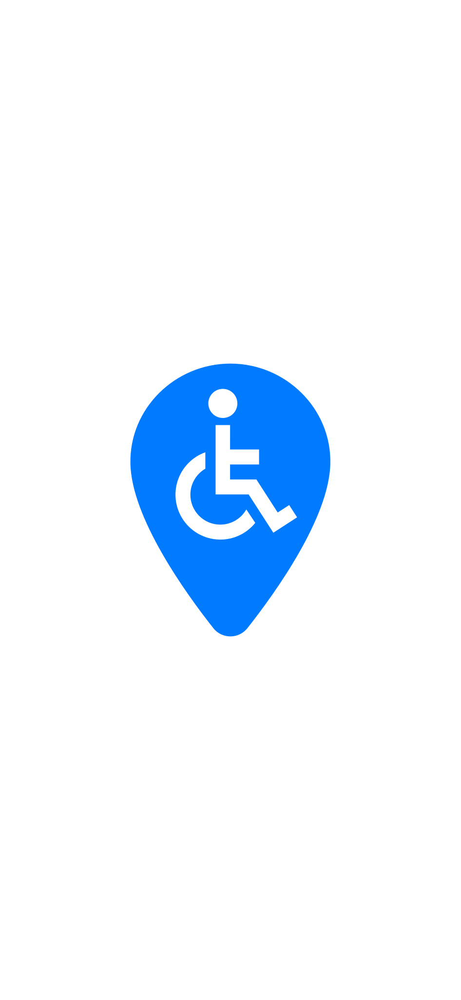

# Zasady Kontrybucji do czyPrzejade

Dziękujemy za zainteresowanie projektem **czyPrzejade**! 
  Tworzymy platformę nawigacji miejskiej niwelującą bariery architektoniczne dla osób z ograniczoną mobilnością.

Projekt rozwija się jako komercyjny startup na etapie pre-seed. Zanim otworzysz Issue lub wyślesz Pull Request, zapoznaj się z poniższymi zasadami prawnymi oraz technicznymi.

  

## 1. Kwestie Prawne, Licencja i Umowa CLA

Zanim dodasz kod lub dokumentację, zapoznaj się z zasadami zarządzania własnością intelektualną w tym repozytorium:

* **Licencja (Business Source License 1.1):** Projekt działa w oparciu o licencję **BSL 1.1**. Kod źródłowy jest publicznie dostępny do celów testowych, badawczych, edukacyjnych oraz niekomercyjnych. Wykorzystanie komercyjne, stawianie płatnych usług w chmurze (SaaS) lub tworzenie konkurencyjnych platform jest zastrzeżone wyłącznie dla założycieli projektu.
* **Umowa Kontrybutora (CLA):** Aby zabezpieczyć startup pod kątem prawnym i przygotować go do rund inwestycyjnych (due diligence), **każdy zewnętrzny kontrybutor musi zatwierdzić umowę CLA**.
* **Jak to działa:** Przy Twoim pierwszym Pull Requeście bot (`cla-assistant`) automatycznie poprosi Cię w komentarzu o zapoznanie się i zatwierdzenie CLA jednym kliknięciem. Pull Requesty bez zatwierdzonego CLA nie będą scalane z kodem głównym.
* **Brak wynagrodzenia finansowego:** Wkład w projekt ma charakter w pełni dobrowolny. Przekazujesz autorom nieodwołalną, bezpłatną licencję komercyjną do wykorzystania kodu w produkcie komercyjnym. Twoje autorstwo pozostaje zachowane w publicznej historii commitów Git.

---

## 2. Obszary, w Których Szukamy Pomocy (Kogo Szukamy)

Szukamy przede wszystkim inżynierów i pasjonatów chcących pomóc w przejściu z prototypu webowego na pełnoprawny produkt mobilny oraz zasileniu systemu danymi:

* **Mobile Engineering & Cross-Platform (React Native / Expo / PWA):**
  * Doświadczenie we wdrażaniu i optymalizacji aplikacji webowych pod urządzenia mobilne (iOS & Android).
  * Pomoc w planowaniu architektury i przyszłej refaktoryzacji frontendu pod dedykowaną aplikację cross-platformową (React Native / Expo lub Capacitor).
  * Wykorzystanie natywnych API smartfona (precyzyjny geolokalizator/GPS w tle, żyroskop, wibracje haptyczne przy ostrzeżeniach o przeszkodach).

* **Web Scraping & Data Crawlers (Python):**
  * Projektowanie niezawodnych, odpornych na blokady crawlerów do pozyskiwania danych o dostępności lokali, instytucji i barier z zewnętrznych serwisów, rejestrów miejskich i portali turystycznych.
  * Standaryzacja i czyszczenie pozyskanych danych przestrzennych (GeoJSON, parsowanie adresów, deduplikacja punktów POI).

* **Architektura & Refaktoryzacja pod Skalowanie:**
  * Przegląd i przygotowanie modularnego API w FastAPI pod obsługę tysięcy zapytań z aplikacji mobilnych bez naruszania limitów zewnętrznych serwisów mapowych.
  * Projektowanie struktur cache'owania i optymalizacja przesyłu paczek GeoJSON na urządzenia o słabym zasięgu sieci komórkowej.

---

## 3. Standardowy Przepływ Pracy (Workflow)

### Krok 1: Wybierz lub Zgłoś Issue
W przypadku większych zmian architektonicznych, algorytmów routingu lub przebudowy UI, najpierw załóż Issue i skonsultuj pomysł z zespołem założycielskim (@sh3kda, @GaskaPiotr, @Antoine052).

### Krok 2: Fork i Praca na Branchach
1. Sforkuj repozytorium na swoje konto GitHub.
2. Utwórz nowego brancha

### Krok 3: Wytyczne Dotyczące Kodu
* **Python (Backend / AI):** Środowisko Python 3.10+. Stosuj jawne typowanie (`typing`, modele Pydantic). Formatuj kod za pomocą standardowych linterów (Black / Ruff).
* **Frontend (Svelte / TypeScript):** Ścisła kontrola typów TypeScript. Dbaj o wysoki kontrast i optymalizację pod kątem urządzeń mobilnych.
* **Opisy commitów:** Pisz zwięzłe komunikaty w trybie rozkazującym (np. `feat: dodaj kare za wysokie krawezniki do grafu routingu`).

### Krok 4: Zgłoszenie Pull Requesta
1. Wyślij PR do gałęzi `main`.
2. Opisz w formularzu:
   * Jaki problem rozwiązuje zmiana,
   * W jaki sposób została przetestowana (współrzędne testowe, test jednostkowy, test w UI),
   * Ewentualny wpływ na czas odpowiedzi (latencję) lub zużycie pamięci.
3. Kliknij link w komentarzu od bota `cla-assistant`, aby zatwierdzić CLA.
4. Poczekaj na weryfikację (code review) od zespołu.

---

## 4. Zasady Społeczności & Kontakt

Budujemy technologię ułatwiającą codzienne funkcjonowanie osobom wykluczonym komunikacyjnie. Oczekujemy wzajemnego szacunku, profesjonalizmu i merytorycznej komunikacji we wszystkich dyskusjach oraz recenzjach kodu.

### Dołącz do naszego Discorda 💬

Chcesz skonsultować pomysł przed napisaniem kodu, pogadać o refaktorze na wersję mobilną, scraperach albo po prostu śledzić rozwój projektu na bieżąco? Wpadaj na nasz serwer:

  

